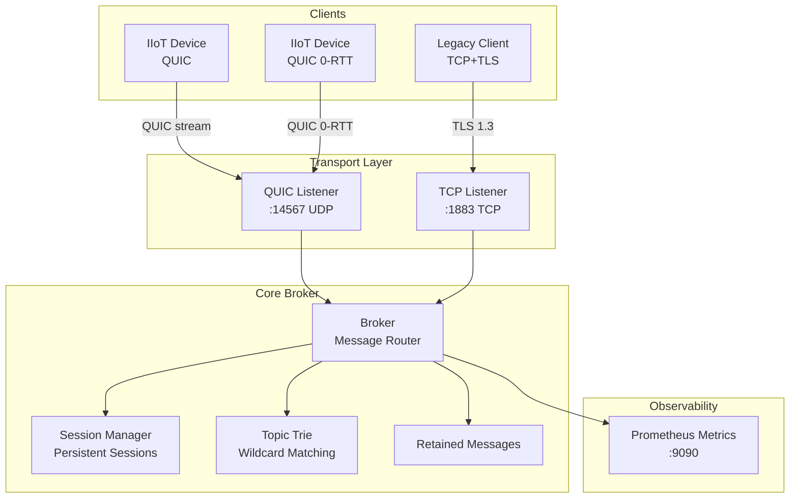

# mqtt-quic-broker

[](https://github.com/sandoe/mqtt-quic-broker/actions/workflows/ci.yml)
[](https://go.dev/)
[](LICENSE)

A **production-grade, high-performance MQTT v5.0 broker** using [QUIC](https://quicwg.org/) as the primary transport layer, written in Go. Designed for **Industrial IoT (IIoT)** applications requiring minimal latency, maximum network efficiency, and industrial-grade security.

## ✨ Key Features

| Feature | Description |
|---------|-------------|
| **MQTT v5.0** | Full MQTT 5.0: QoS 0/1/2, retained messages, LWT, session expiry, user properties |
| **QUIC Transport** | Primary transport via [quic-go](https://github.com/quic-go/quic-go) — no head-of-line blocking |
| **0-RTT Resumption** | QUIC 0-RTT for instant reconnection of IIoT devices |
| **TCP+TLS Fallback** | Optional TCP+TLS for legacy MQTT clients |
| **TLS 1.3 + mTLS** | Mutual TLS for industrial device authentication |
| **Topic Wildcards** | Full `+` (single-level) and `#` (multi-level) wildcard support via topic trie |
| **Message Priority** | Control/alarm/safety topics get priority routing |
| **Prometheus Metrics** | Connection counts, throughput, QUIC handshake times, latency histograms |

## Architecture



## Quick Start

### Prerequisites

- Go 1.21+
- OpenSSL (for certificate generation)

### 1. Generate TLS certificates

```bash
bash scripts/generate_certs.sh
```

### 2. Build and run

```bash
make build
make run
# or directly:
./bin/mqtt-quic-broker --config configs/broker.yaml
```

### 3. Docker

```bash
bash scripts/generate_certs.sh
docker-compose up broker
curl http://localhost:9090/health
```

## Configuration Reference

Edit `configs/broker.yaml`:

```yaml
broker:
  max_clients: 10000
  session_expiry_seconds: 3600
  priority_topics:
    - "control/"
    - "alarm/"
    - "safety/"
  rate_limit_msg_sec: 10000
  rate_limit_burst: 1000

quic:
  enabled: true
  listen_addr: ":14567"
  allow_0rtt: true

tcp:
  enabled: true
  listen_addr: ":1883"

tls:
  cert_file: "certs/server.crt"
  key_file: "certs/server.key"
  ca_file: "certs/ca.crt"
  mutual_tls: false     # Set true for mTLS

metrics:
  enabled: true
  listen_addr: ":9090"

logging:
  level: "info"         # debug, info, warn, error
  format: "json"        # json, text
```

## Ports

| Port | Protocol | Purpose |
|------|----------|---------|
| 14567 | UDP (QUIC) | Primary MQTT over QUIC |
| 1883 | TCP (TLS) | MQTT over TCP+TLS fallback |
| 9090 | TCP (HTTP) | Prometheus metrics + health check |

## Client Library Usage

```go
import (
    "context"
    "github.com/sandoe/mqtt-quic-broker/pkg/client"
    "github.com/sandoe/mqtt-quic-broker/internal/mqtt"
)

c, err := client.Connect(ctx, client.Options{
    BrokerAddr: "broker.example.com:14567",
    ClientID:   "my-device-001",
    CleanStart: true,
    OnMessage: func(topic string, payload []byte, qos mqtt.QoS) {
        fmt.Printf("[%s] %s\n", topic, payload)
    },
})

c.Publish(ctx, "sensors/temperature", []byte(`{"value":22.5}`), mqtt.QoS1)
c.Subscribe(ctx, "control/#", mqtt.QoS2)
c.Disconnect()
```

## IIoT Design Decisions

1. **QUIC over TCP**: Eliminates head-of-line blocking. Each MQTT stream is independent.
2. **0-RTT connection resumption**: IIoT devices reconnect instantly after sleep/outage.
3. **Message prioritization**: `control/`, `alarm/`, `safety/` topics routed first.
4. **mTLS device authentication**: Each IIoT device gets its own client certificate.
5. **Prometheus observability**: Handshake times, message latency percentiles, queue depths.

## Prometheus Metrics

| Metric | Type | Description |
|--------|------|-------------|
| `mqtt_broker_connected_clients` | Gauge | Current connected clients |
| `mqtt_broker_total_connections_total` | Counter | Total connections accepted |
| `mqtt_broker_connect_latency_seconds` | Histogram | CONNECT processing latency |
| `mqtt_broker_messages_published_total` | Counter | Messages published (by QoS) |
| `mqtt_broker_messages_delivered_total` | Counter | Message deliveries to subscribers |
| `mqtt_broker_quic_handshake_duration_seconds` | Histogram | QUIC TLS handshake duration |
| `mqtt_broker_quic_0rtt_connections_total` | Counter | 0-RTT connections |
| `mqtt_broker_active_sessions` | Gauge | Total active sessions |

## Development

```bash
make test    # tests with race detector
make bench   # benchmarks
make lint    # golangci-lint
```

## License

MIT — see [LICENSE](LICENSE).
